<div align="center">

# Pós Tech FIAP - Tech Challenge - Grupo 12


<br>

</div>

### 👨‍💼👩‍💼‍ Autores

Este é um projeto que está em construção pelos desenvolvedores:


<br>

<br>

<br>

<br>


## 💻 Descrição

Este monolito é responsável por gerenciar a entrada de pedidos de um restaurante. Ele lida com o processamento dos
pedidos, gerenciamento de pagamentos e envio dos pedidos para a cozinha após a confirmação do pagamento.

### ⚠️ Problema

<p align="justify">Uma lanchonete em expansão enfrenta dificuldades em gerenciar pedidos de forma eficiente sem um sistema adequado, o que pode causar confusão, atrasos e insatisfação dos clientes. Pedidos complexos, como hambúrgueres personalizados, podem ser mal interpretados ou esquecidos, impactando negativamente os negócios. Para resolver esse problema, a lanchonete vai investir em um sistema de autoatendimento, permitindo que os clientes façam pedidos diretamente, sem depender de atendentes, otimizando o processo e melhorando a experiência dos clientes.</p>

## 🎥 Vídeo de apresentação

Para assistir ao vídeo de apresentação do projeto, que contém:
- A descrição detalhada do problema
- Arquitetura utilizada no projeto
- Solução de infraestrutura proposta
- Demonstração da aplicação em funcionamento

basta acessar o link: <LINK_PARA_O_VIDEO_AQUI!!!!>

## 🛠 Tecnologias Utilizadas

<div align="center">


</div>

## 💫 Arquitetura

O projeto segue a Clean Architecture, permitindo maior flexibilidade e facilidade de manutenção.

### Desenho da arquitetura

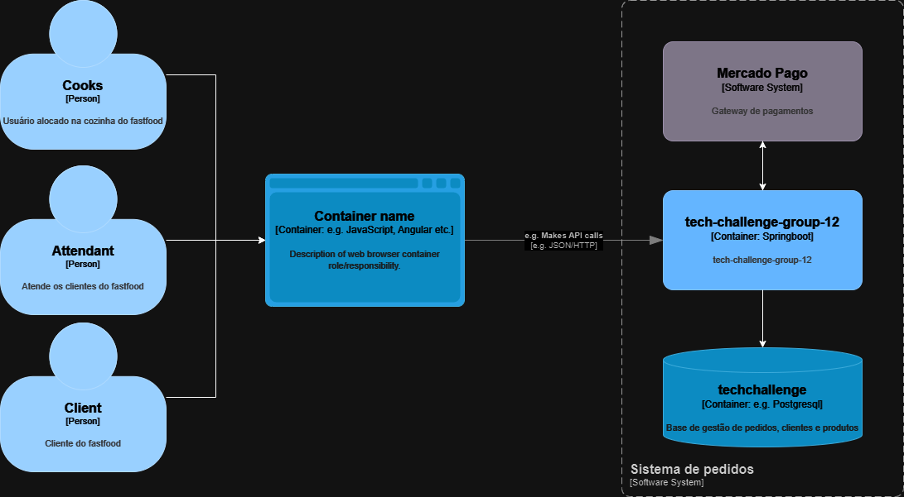

### Desenho da infraestrutura

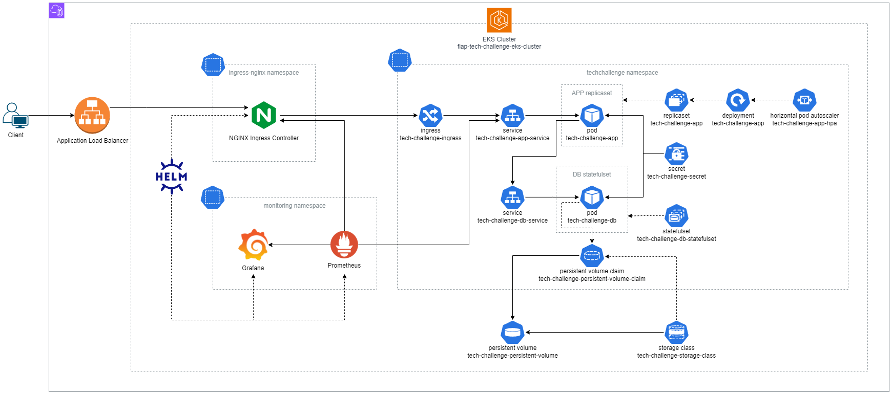

### Diagramas sequenciais

<details style="cursor: pointer;">
 <summary style="background-color: #086dd7b0; border-radius: 5px; font-size: 15px; padding-left: 6px; font-weight: bold;">Diagrama sequencial de customers </summary>
 <br>
 
 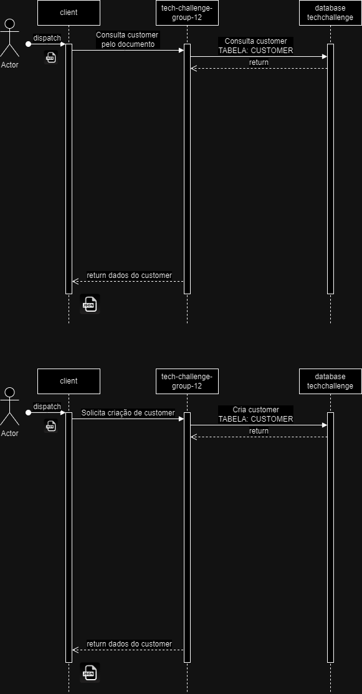

</details>

<details style="cursor: pointer;">
 <summary style="background-color: #086dd7b0; border-radius: 5px; font-size: 15px; padding-left: 6px; font-weight: bold;">Diagrama sequencial de products </summary>
 <br>
 
 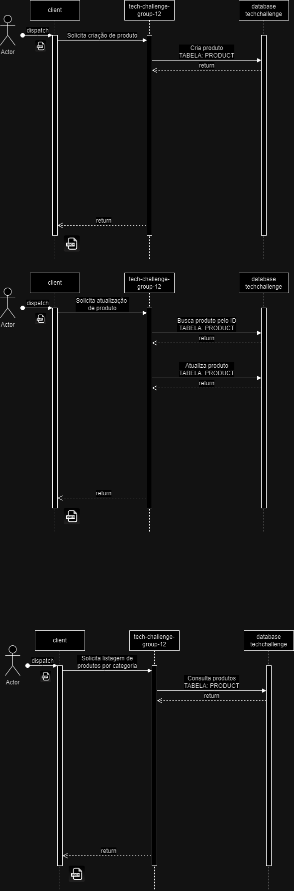

</details>

<details style="cursor: pointer;">
 <summary style="background-color: #086dd7b0; border-radius: 5px; font-size: 15px; padding-left: 6px; font-weight: bold;">Diagrama sequencial de orders </summary>
 <br>
 
 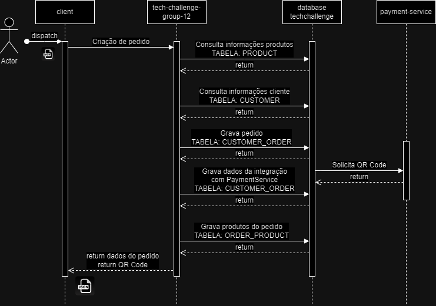
 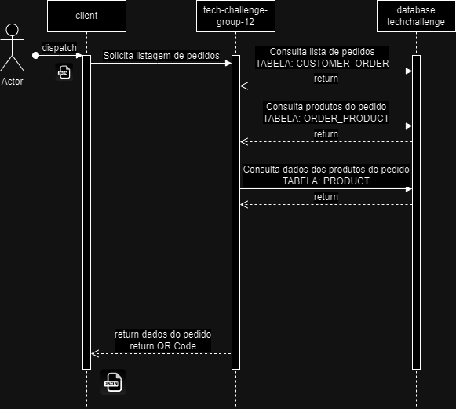

</details>

## ⚙️ Configuração

### Pré-requisitos

#### Desenvolvimento

- **[Java 21](https://docs.oracle.com/en/java/javase/21/)**: Documentação oficial do Java 21.
- **[Maven 3.6.3+](https://maven.apache.org/)**: Site oficial do Maven.
- **[Docker](https://www.docker.com/)**: Site oficial do Docker.
- **[Docker Compose](https://docs.docker.com/compose/)**: Documentação oficial do Docker Compose.
- **[Kubernetes](https://kubernetes.io/pt-br/docs/home/)**: Documentação oficial do Kubernetes.
- **[Terraform](https://www.terraform.io/)**: Site oficial do Terraform.
- **[Mercado Pago](https://www.mercadopago.com.br/developers/pt/docs/qr-code/integration-configuration/qr-dynamic/integration)**: Documentação oficial do Mercado Pago.

### 🐳 Imagem Docker

A imagem docker desse projeto foi buildada através do arquivo `Dockerfile` presente neste repositório, e enviada a um
container registry (Docker HUB). Para visualizá-la, basta acessar o
link: https://hub.docker.com/r/willosouza/fiap-soat-tech-challenge

Caso queira dar um pull na imagem, basta rodar o comando `docker pull willosouza/fiap-soat-tech-challenge:latest`, que a imagem mais recente será baixada.

### 🚀 Execução

<details style="cursor: pointer;">
 <summary style="background-color: #086dd7b0; border-radius: 5px; font-size: 15px; padding-left: 6px; font-weight: bold;">Subindo aplicação via Docker Compose</summary>
<br>
Este projeto conta com um arquivo `docker-compose.yml` que pode ser utilizado para subir o container da aplicação e suas
respectivas dependências (banco de dados).

Para subir as aplicações, primeiro se faz necessária a existência de um arquivo `.env` na raiz do projeto, para que as
variáveis de ambiente sejam definidas. Esse projeto já conta com um arquivo versionado nesse repositório, para que a
definição das variáveis não precise ser feita. Abaixo segue a estrutura desse arquivo:

```sh
POSTGRES_URL=<url_do_banco_de_dados>
POSTGRES_DB=<nome_do_banco_de_dados>
POSTGRES_USERNAME=<usuário_do_banco_de_dados>
POSTGRES_PASSWORD=<senha_do_usuário_no_banco_de_dados>
```

Após se certificar que o arquivo `.env` existe e está definindo as variáveis citadas acima, basta executar o
comando `docker compose up` para iniciar o build da imagem da aplicação (Definida no arquivo `Dockerfile`) e realizar a
inicialização do container do banco de dados (Postgres) seguido pelo container da aplicação.

Caso tudo dê certo, as seguintes linhas de log devem ter sido exibidas no terminal cujo comando foi executado:

- Pull da imagem do postgres:


- Build da imagem da aplicação utilizando o conteúdo do Dockerfile:


- Criando volume e containers:


- Container do postgres de pé e rodando com sucesso


- Container da aplicação de pé e rodando com sucesso


Após todos esses passos, basta rodar o comando `docker container ls` para verificar quais containers estão sendo
executados. Caso tudo tenha corrido com sucesso, o comando deve ter o seguinte resultado:


Por fim, o serviço estará disponível em `http://localhost:8357` com contextPath `/api`

Obs: Caso queira subir os containers no modo `detached`(Sem travar o terminal em que o comando for executado), basta
rodar o seguinte comando: `docker compose up -d`


</details>

<details style="cursor: pointer;">
 <summary style="background-color: #086dd7b0; border-radius: 5px; font-size: 15px; padding-left: 6px; font-weight: bold;">Subindo aplicação em Cluster Kubernetes local (Ex: Docker Desktop ou Minikube)</summary>
 <br>

 Uma outra forma de subir a aplicação, é fazendo uso dos manifestos kubernetes (arquivos yaml) presentes na pasta `/infra/k8s` e implantar os recursos em um cluster K8S local. Para realizar isso, basta seguir os passos a seguir:
  
  1. Certificar que o Cluster local esteja executando (Para o exemplo do minikube, basta rodar os comandos `minikube start` para inicializar o cluster e `minikube status` para verificar o status do cluster);
  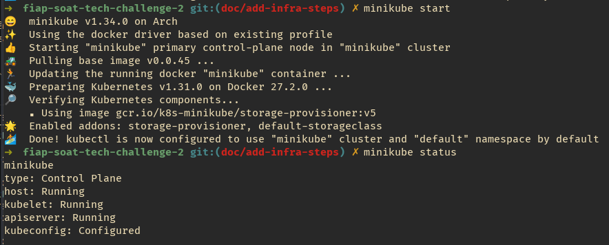
  
  2. Certificar que o Terraform esteja instalado executando o comando `terraform --version`;
  

  3. Entrar na pasta `infra/terraform`;
  4. Inicializar o Terraform no projeto `terraform init`;
  5. Verificar que o script do Terraform é valido rodando o comando `terraform validate`;
  6. Executar o comando `terraform plan -var-file="./inventories/minikube/terraform.tfvars"` para executar o planejamento da execução/implementação. No caso da execução em um cluster kubernetes do `Docker Desktop`, basta executar o comando `terraform plan`, sem adicionar o caminho para o arquivo de variáveis;
  7. Executar o comando `terraform apply  -var-file="./inventories/minikube/terraform.tfvars"` para criar a infra dentro do cluster;

  Para acessar a aplicação, será necessário acessar a rota através do IP Público do service do ingress. Esse passo é muda de acordo com o Cluster local que você estiver utilizando:
  Caso esteja utilizando Docker Desktop:
  1. Executar o comando `kubectl get svc -n ingress-nginx`;
  2. Verificar que o svc `nginx-ingress-ingress-nginx-controller` que é do tipo `LoadBalancer` está com o EXTERNAL-IP definido como `localhost`;
  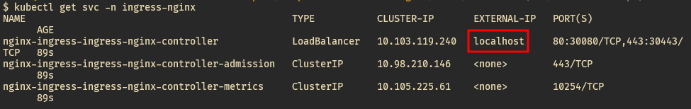

  3. Acessar a aplicação utilizando o localhost;
  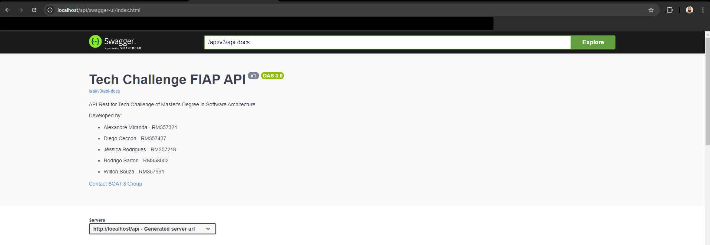

  Caso esteja utilizando MiniKube:
  1. Executar o comando `minikube tunnel`;<br>
  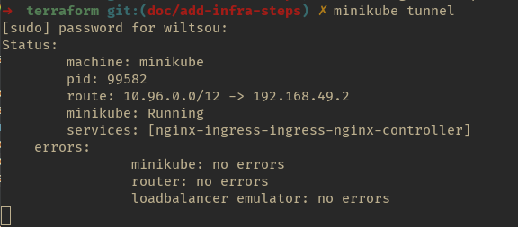

  2. Executar o comando `kubectl get svc -n ingress-nginx`;
  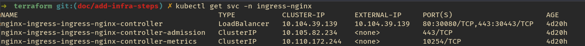

  3. Verificar o IP Externo do service e acessar a aplicação utilizando o mesmo;
  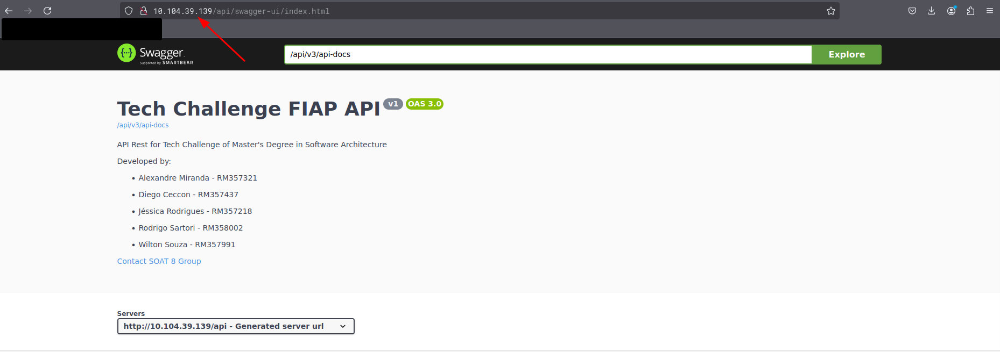

</details>

<details style="cursor: pointer;">
  <summary style="background-color: #086dd7b0; border-radius: 5px; font-size: 15px; padding-left: 6px; font-weight: bold;">Subindo aplicação em Cluster EKS</summary>
  <br>
  
  1. Certificar que o Terraform esteja instalado executando o comando `terraform --version`;
  

  2. Certificar que o `aws cli` está instalado e configurado com as credenciais da sua conta AWS;
  

  3. Acessar a pasta `infra/eks/cluster` que contém os arquivos que irão criar um Cluster EKS e Work Nodes na AWS;
  4. Inicializar o Terraform no projeto `terraform init`;
  5. Verificar que o script do Terraform é valido rodando o comando `terraform validate`;
  6. Executar o comando `terraform plan` para executar o planejamento da execução/implementação;
  7. Executar o comando `terraform apply` para criar a infra dentro do cluster;
  8. Após a execução do Terraform finalizar, verificar se o cluster e os nodes foram inicializados na AWS;
  
  9. Após a criação do cluster, é necessário configurar o kubeconfig para que o `kubectl` aponte para o novo cluster criado na AWS. Para fazer isso, basta executar o comando `aws eks update-kubeconfig --region us-east-1 --name fiap-tech-challenge-eks-cluster`. A region escolhida para que o cluster seja criado foi a `us-east-1` e o nome do cluster é `fiap-tech-challenge-eks-cluster`
  10. Acessar a pasta `infra/eks/infra` que contém os arquivos que irão criar os Pods da aplicação e do Banco de Dados, os services e os recursos relacionados à monitoração na AWS;
  11. Inicializar o Terraform no projeto `terraform init`;
  12. Verificar que o script do Terraform é valido rodando o comando `terraform validate`;
  13. Executar o comando `terraform plan` para executar o planejamento da execução/implementação;
  14. Executar o comando `terraform apply` para criar a infra dentro do cluster;
  15. Após a execução do Terraform finalizar, verificar se os recursos foram criados corretamente na conta AWS;

  Para acessar a aplicação, basta acessar o serviço Load Balancer na AWS, copiar o DNS do load balancer que foi criado e acessar as rotas da aplicação utilizando o DNS gerado.
  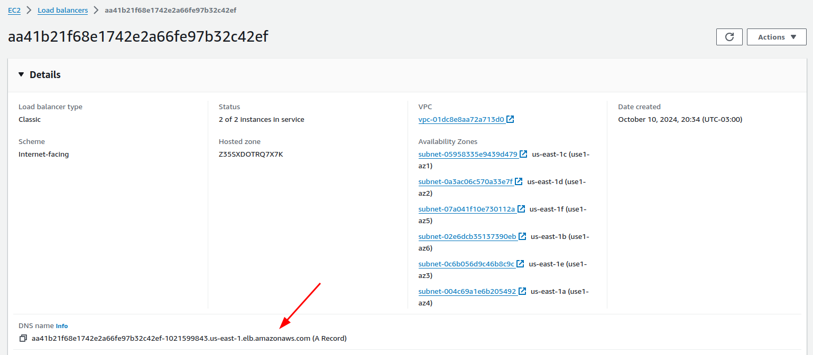
  

  Também é possível acessar os dashs do grafana utilizando a mesma dns do load balancer: `<load-balancer-dns>/grafana/login`
  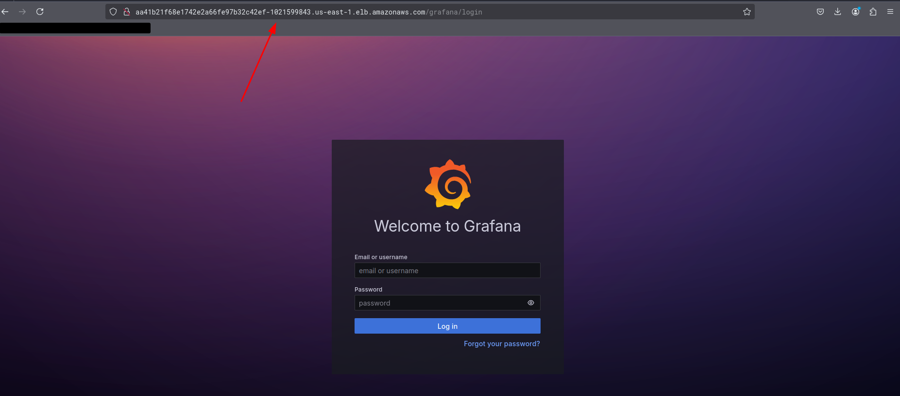

  As credenciais de acesso ao grafana são:

  username: `admin`
  password: `techchallenge`
</details>

### 🛒 Integração Checkout (Mercado Pago)

Nesta fase do projeto, integramos o Checkout com a API do Mercado Pago, possibilitando o pagamento via QR Code dinâmico.

Para que o QR Code seja criado, deve-se primeiro criar um pedido (POST) no endpoint `/api/v1/orders`. Após a execução desse endpoint, uma chamada interna será feita para a API do Mercado Pago (POST) no endpoint `https://api.mercadopago.com/instore/orders/qr/seller/collectors/{user_id}/pos/{external_pos_id}/qrs` para gerar o QR Code. Com a string do QR gerada, o pagamento poderá ser realizado. Após a confirmação do pagamento ou a ocorrência de uma falha, receberemos uma requisição no nosso webhook (POST) `/api/v1/webhook-payment`.

Exemplo do recebimento do webhook mandado pelo Mercado Pago: 
```bash
{
  "action": "payment.updated",
  "api_version": "v1",
  "data": {
    "id": "123456"
  },
  "date_created": "2021-11-01T02:02:02Z",
  "id": "123456",
  "live_mode": false,
  "type": "payment",
  "user_id": 1986357239
}
```
Em seguida, uma requisição será feita internamente para o endpoint (GET) `https://api.mercadopago.com/v1/payments/{id}` do Mercado Pago para verificar o status do pagamento. Se o status for `approved`, alteraremos o status do pedido na nossa aplicação para `PREPARING`.

Caso ocorram falhas e o pagamento não seja efetivado dentro do intervalo de meia hora desde a criação do pedido, o pagamento não poderá ser realizado devido ao tempo de expiração, e o pedido será atualizado automaticamente para `FINISHED`. Isso será feito pelo nosso `Scheduled`, que buscará todos os pedidos com status `RECEIVED` criados há mais de meia hora e os atualizará para o status `FINISHED`.

Observação: Deve-se considerar que nossa integração está sendo feita com o uso das contas de teste criadas no Mercado Pago.

### 📄 Documentação da API

Link para acessar ao swagger após subir a aplicação:

```bash
# Ambiente Local via docker compose
http://localhost:8357/api/swagger-ui/index.html

# Ambiente Local via cluster kubernetes do docker desktop
http://localhost/api/swagger-ui/index.html

# Ambiente Local via cluster kubernetes do minikube
http://<external_ip_do_service_do_nginx>/api/swagger-ui/index.html

# Ambiente AWS via cluster EKS
http://<endereço_dns_do_load_balancer>/api/swagger-ui/index.html
```

### 🔃 Ordem de execução das APIs

1. O primeiro passo, que é opcional, seria realizar a criação de um novo usuário (cadasto de usuário) utilizando o endpoint (POST) `/api/v1/customers`
2. Após o cadastro do usuário, o próximo passo, que também é opcional (pois nossa aplicação já fornece `seeds` no banco de dados, com produtos pré-cadastrados), seria realizar o cadastro de um novo produto através do endpoint (POST) `/api/v1/products`
3. O próximo passo é realizar a listagem de todos os produtos por categoria através do endpoint (GET) `/api/v1/products`, para saber quais estão disponíveis
4. Com os produtos escolhidos em mãos, o próximo passo é realizar a criação de um pedido através do endpoint (POST) `/api/v1/orders`, e salvar o código do QRCode retornado no response, para realizar o pagamento do mesmo posteriormente
5. Após realizar a criação do pedido, é possível verificar se o mesmo foi criado através do endpoint (GET) `/api/v1/orders`. O mesmo deve estar listado no response dentro do status `received`
6. O próximo passo será realizar o pagamento do pedido criado. Para realizar o pagamento do pedido, basta ler o QRCode gerado no passo 4 (Para realizar a leitura do mesmo, é necessário utilizar um site que transforma a string Pix em uma imagem QRCode, como por exemplo o [https://www.qrcode-monkey.com/](https://www.qrcode-monkey.com/)) e realizar o pagamento através do aplicativo do mercado pago (Pois a aplicação está integrada ao gateway de pagamentos do mercado pago)
7. Após ter efetuado o pagamento do pedido, é possível verificar se o mesmo foi realmente pago realizando uma chamada ao endpoint (GET) `/api/v1/orders/{id}/paid-status`.
8. Também é possível verificar que o status do pedido foi atualizado para `preparing` chamando novamente o endpoint (GET) `/api/v1/orders`;
9. Para simular que a preparação do pedido foi finalizada pela cozinha, e que o pedido está pronto para ser retirado pelo cliente, basta chamar o endpoint (PATCH) `/api/v1/orders/{id}`
10. Após isso, é possível verificar que o status do pedido foi atualizado para `ready` chamando novamente o endpoint (GET) `/api/v1/orders`;
11. Finalizando a esteira de entrega do pedido, é possível simular o ato de retirada do mesmo pelo cliente, realizando uma nova chamada ao endpoint (PATCH) `/api/v1/orders/{id}`
12. E como último passo, é possível verificar novamente o status do pedido utilizando o endpoint (GET) `/api/v1/orders`. Neste caso, como o pedido foi atualizado para o status `finished`, o mesmo não deve mais estar sendo exibido no retorno do endpoint chamado.

Além dos endpoints listados acima, existem outros que não fazem parte do fluxo padrão da aplicação, mas que podem ser utilizados:
1. É possível realizar uma chamada ao endpoint (PUT) `/api/v1/products/{id}` para realizar a atualização de um produto qualquer (Que já tenha sido criado)
2. É possível realizar uma chamada ao endpoint (DELETE) `/api/v1/products/{id}` para realizar a exclusão de um produto qualquer (Que exista)
3. Existe um endpoint que não é chamado diretamente pelo cliente, que é o `/api/v1/webhook-payment`. Este endpoint é responsável por receber a resposta do gateway de pagamentos, relacioada a ação de pagamento do pedido (Pagamento realizado, ou falha no pagamento)
4. Caso queira, é possível verificar se o usuário foi cadastrado e também ver o detalhamento das informações do usuário através do endpoint (GET) `/api/v1/customers/{document}`

### 🎲 Seeds

Para facilitar o consumo e os testes da aplicação, seeds de dados foram criadas e gerenciadas utilizando o `Flyway`. 
Essas seeds são aplicadas automaticamente ao iniciar a aplicação, garantindo um ambiente consistente e pronto para uso.

### 📚 MIRO - Event Storming


Acesso ao MIRO com o Event Storming:
[Event Storming](https://miro.com/app/board/uXjVK1ekBDM=/)
